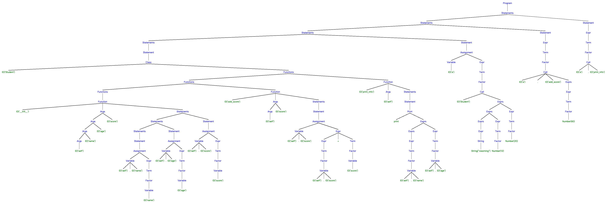

<h3 align="center">编译原理实践第1415次课<br/>基于PLY的Python解析-4</h3>
<p align="center">张昊 &nbsp;&nbsp; 1927405160</p>

### 概述

使用 Python3 以及 PLY 库实现了简易的 Python 解析器。主要涉及的知识有语法分析，语法制导翻译。
除了赋值语句、完整的四则运算、print语句、选择语句、循环语句、列表、len函数、下标访问、函数声明与函数调用，实现了**类的解析**、**类中变量的翻译**、**类中函数的翻译**。
同时也解决了一些上次实验遗留的bug。

### 编程说明

- **语言**：Python 3
- **文件编码**：UTF-8 
- **依赖**：PLY
- **测试环境**：Python 3.8.10

#### Python程序的解析

设计了如下文法来实现词法分析：

```
运算符定义略
保留字：print len if elif while for break and or def return class
ID -> [A-Za-z_][A-Za-z0-9_]*
NUMBER -> \d+
STRING -> ".*"|'.*'
```

【注】这里NUMBER只能识别非负整数，对于负号的实现应该在语法分析中定义产生式来实现。（这里是上一个实验报告遗留的一个bug）但是样例中没有负数出现。因此，这一版本的代码暂不支持纯负数的解析（可以通过0-num来间接实现）。

> 识别 ID，首先检查是否为保留字，若是则申明其类型，否则为 ID

字符串的解析：

- 单纯使用正则表达式 `".*"|'.*'` 无法解决 `"string" <token> "string"` 的输入，会将中间的 token 包含在字符串中，从而产生错误。
- 原因是这一文法不属于正则文法，无法使用正则表达式解决。
- 解决办法是在匹配到整个字符串的基础上做一次遍历，找到第一个结束引号的位置:除第一个引号外，首次出现的不在 `\` 字符后面的引号;并修改 `lexer.lexpos` (分析点)和 `value` 即可。

设计了如下语法来实现语法分析

```
program : statements
statements : statements statement | statement
statement : assignment | expr | print | if | while | for | break | function | return | class
assignment : variable ASSIGN expr 
           | variable MINEQUAL expr 
           | variable PLUSEQUAL expr 
           | variable DPLUS 
           | variable DMINUS
variable : variable LBRACKET expr RBRACKET | ID | ID DOT ID
expr : expr PLUS term | expr MINUS term | term | array | string
term : term TIMES factor | term DIVIDE factor | term EDIVIDE factor | factor
factor : variable | NUMBER | len | call | LPAREN expr RPAREN
exprs : exprs COMMA expr | expr
len : LEN LPAREN variable RPAREN
print : PRINT LPAREN exprs RPAREN | PRINT LPAREN RPAREN
array : LBRACKET exprs RBRACKET | LBRACKET RBRACKET
condition : condition OR join | join
join : join AND equality | equality
equality : equality EQ rel | equality NE rel | rel
rel : expr LT expr | expr LE expr | expr GT expr | expr GE expr | expr
if : IF LPAREN condition RPAREN LBRACE statements RBRACE
   | IF LPAREN condition RPAREN LBRACE statements RBRACE else
else : ELIF LPAREN condition RPAREN LBRACE statements RBRACE
     | ELIF LPAREN condition RPAREN LBRACE statements RBRACE else
     | ELSE LBRACE statements RBRACE
while : WHILE LPAREN condition RPAREN LBRACE statements RBRACE
for : FOR LPAREN assignment SEMICOLON condition SEMICOLON assignment RPAREN LBRACE statements RBRACE
break : BREAK
function : DEF ID LPAREN args RPAREN LBRACE statements RBRACE | DEF ID LPAREN RPAREN LBRACE statements RBRACE
args : args COMMA ID | ID
call : ID LPAREN exprs RPAREN | ID LPAREN RPAREN | ID DOT ID LPAREN exprs RPAREN | ID DOT ID LPAREN RPAREN
return : RETURN | RETURN exprs
class : CLASS ID LBRACE functions RBRACE
functions : functions function | function
string : STRING
```

其中：

- expr、term、factor 定义了四则运算的语法。
- exprs 实现了函数的实参传递。
- args 实现了函数的形参定义。
- variable 定义了ID和数组下标访问语法，使用了C++中左值的概念，为可读可写的引用，对其的读写需要同过符号表。 
- len 定义了 Python 函数 len() 的语法，规定传入的只能是左值。
- array 利用 exprs 实现了 Python 的列表定义。
- 将赋值、（右）自增、（右）自减合并为赋值语句，并实现了 `+=`、`-=` 运算符。
  这里考虑到解析的代码中只是对变量进行自增，故未实现左自增（对称实现即可）。
- condition、equality、join、rel 实现了判断中的条件，并在实现了`and`和`or`表达式以及优先级。
- if、for、while 实现了分支和循环语句。本次重写了if语句，实现了完整意义上的多路分支语法。 
- function 实现了函数的定义，call 实现了函数的调用。这里扩展了上一次实验的 call 的定义，从而可以解析对象成员函数的调用。
- class、functions 实现了类的定义和解析。
- string 实现了字符串的匹配。

另外定义了一系列节点，与语法分析过程中相对应。

#### 语法制导翻译

如上一小节的代码所示，每个节点都有一个 value 属性（左值Variable的value属性被禁用，而是应该通过符号表来检索值），
用来保存节点的值。
（如没有值则为None，数值类型则会赋给一个自定义的单例NIL，表示未赋值的变量，且与None的区分）
另外设计了一个符号表，用以保存每个变量的值。
具体地，当使用赋值语句为一个变量赋值时，会在符号表中添加名为该变量名的记录；
当访问一个变量的值时，会到表中查找该变量的值，如不存在则报错。
函数同变量存于同一个变量表中。

对于if、for、while，提前翻译条件condition，根据结果来判断分支是否执行或循环是否继续。

对于循环，定义变量loop_flag用来标识循环的层数，大于0为循环层数，等于0为不在循环内，小于0非法。

对于break，定义变量break_flag来指示是否遇到了break，
如果遇到了，则后续节点都不翻译，并跳出循环。

对于函数定义，定义了一个Function类，保存函数的名称、形参和函数体（语法树），调用时传入实参和当前的变量表，遍历语法树（函数体）。

为实现函数的递归调用，将翻译函数封装类，从而可以利用对象来隔离状态，并通过函数调用来实现函数调用的压栈、出栈动作。

对于类的定义，定义Class类表示类的基本信息（类名、函数），定义PyObject类表示类创建的对象，包含所属类以及属性。
需要显示调用构造函数初始化对象；使用下标运算符来访问各属性（这样做是为了保证维护符号表的动作统一）；翻译类的成员函数调用时显示传入一个self对象。
具体实现如下：

```python
class Class:
    def __init__(self, name, funcs):
        self.name = name
        tran = Translator(funcs)
        tran.translate()
        self.functions = tran.var_table
    def __repr__(self):
        return f"<Class object '{self.name}'>"

class PyObject:
    def __init__(self, cls):
        self.cls = cls
        self.props = {}
        self.props.update(self.cls.functions)
    def __repr__(self):
        address = hex(id(self))
        return f"<PyObject {self.cls.name} at {address}>"
    def constructor(self, args):
        if self.cls.functions.get('__init__', None) is None:
            assert len(args) == 0, "default constructor doesn't need argument(s)!"
            return
        _, tran = self.cls.functions['__init__'].exec(env=None, args=[self] + args)
        for name, value in tran.var_table.items():
            self.props[name] = value
    def __getitem__(self, item):
        assert isinstance(item, str)
        if self.props.get(item, None) is None:
            raise AttributeError(f"'{self.cls.name}' object has no attribute '{item}'")
        return self.props[item]
    def __setitem__(self, key, value):
        assert isinstance(key, str)
        self.props[key] = value
```

以上代码实现详见 translate.py 。

其余部分，采用深度优先的顺序遍历整个语法树，具体实现详见代码。

### 运行

项目结构为：

```
.
├── README.pdf    # 本文档
├── stu.py        # 输入文件
├── main.py       # 主程序
├── node.py       # 节点定义文件
├── parser.out    # PLY生成的文件
├── parsetab.py   # PLY生成的文件
├── py_lex.py     # 词法分析文件
├── py_yacc.py    # 语法分析文件
└── translation.py    # 翻译器
```

主程序接受一个参数，为输入文件的路径。运行方法如下：

~~~bash
$ python3 main.py <py-file>
~~~

输入文件：stu.py

~~~python
class Student{
	def __init__(self,name,age,score){
		self.name=name
		self.age=age
		self.score=score
	}
	
	def add_score(self,score){
		self.score=self.score+score
	}
		
	def print_info(self){
		print(self.name,self.age)
	}
}

a=Student('xiaoming',12,20)
a.add_score(60)
a.print_info()
~~~

运行结果如下：

~~~
语法树： [Program [Statements [Statements [Statements [Statements [Statement [Class ID('Student') [Functions [Functions [Functions [Function ID('__init__') [Args [Args [Args [Args ID('self')] ID('name')] ID('age')] ID('score')] [Statements [Statements [Statements [Statement [Assignment [Variable ID('self') [.] ID('name')] [Expr [Term [Factor [Variable ID('name')]]]]]]] [Statement [Assignment [Variable ID('self') [.] ID('age')] [Expr [Term [Factor [Variable ID('age')]]]]]]] [Statement [Assignment [Variable ID('self') [.] ID('score')] [Expr [Term [Factor [Variable ID('score')]]]]]]] ]] [Function ID('add_score') [Args [Args ID('self')] ID('score')] [Statements [Statement [Assignment [Variable ID('self') [.] ID('score')] [Expr [Expr [Term [Factor [Variable ID('self') [.] ID('score')]]]] [+] [Term [Factor [Variable ID('score')]]]]]]] ]] [Function ID('print_info') [Args ID('self')] [Statements [Statement [Print [print] [Exprs [Exprs [Expr [Term [Factor [Variable ID('self') [.] ID('name')]]]]] [Expr [Term [Factor [Variable ID('self') [.] ID('age')]]]]] ]]] ]] ]]] [Statement [Assignment [Variable ID('a')] [Expr [Term [Factor [Call ID('Student') [Exprs [Exprs [Exprs [Expr [String String("xiaoming")]]] [Expr [Term [Factor Number(12)]]]] [Expr [Term [Factor Number(20)]]]] ]]]]]]] [Statement [Expr [Term [Factor [Call ID('a') [.] ID('add_score') [Exprs [Expr [Term [Factor Number(60)]]]] ]]]]]] [Statement [Expr [Term [Factor [Call ID('a') [.] ID('print_info') ]]]]]]]
运行结果：
xiaoming 12
当前变量表： {'Student': <Class object 'Student'>, 'a': <PyObject Student at 0x1010eb7c0>}
~~~

> 如果图片不清晰，请点击如下链接：[http://repo.holgerbest.top/html/stu.png](http://repo.holgerbest.top/html/stu.png)

语法树：



